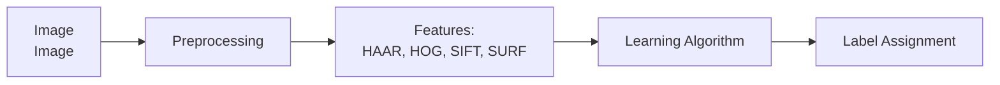

# Image recognition and object detection

## Introduction

Traditional computer vision pipeline:

* Step 1: Pre-processing image to normalize contrast and brightness effects
* Step 2: Extract features (e.g. HAAR like features, HOG - Histogram of Oriented Gradients, SIFT - Scale-Invariant Feature Transform, SURF - Speeded Up Robust Feature)
* Step 3: Learning algorithm (e.g. SVM - Support Vector Machine)
* Step 4: Assign label on input image
