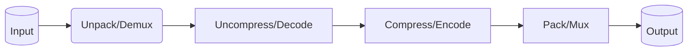
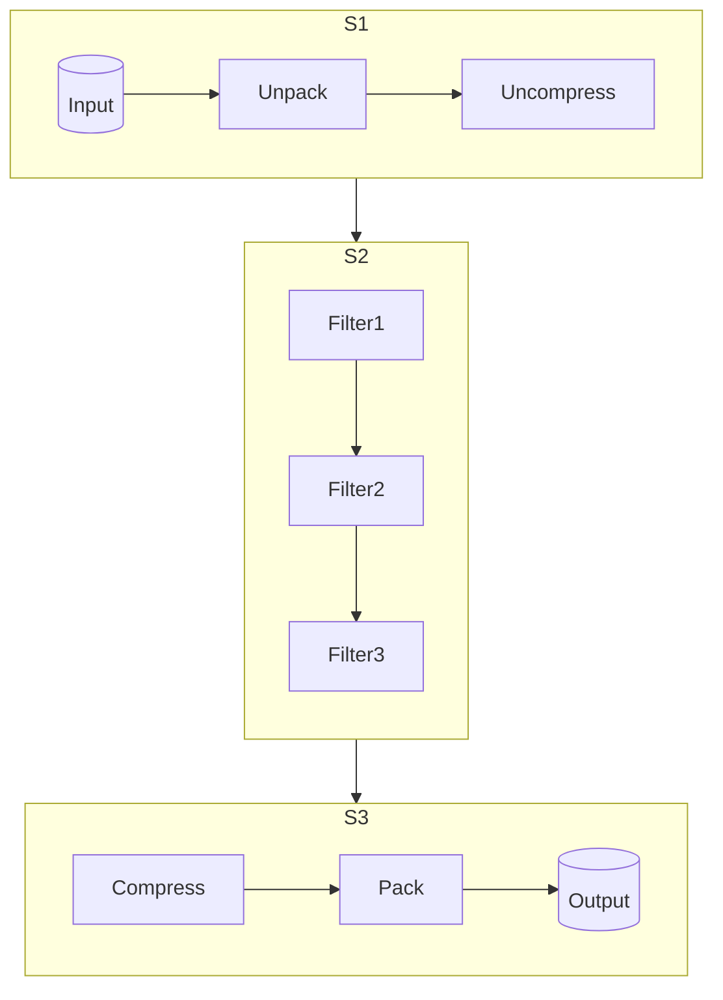

## Terminology
### Images

* Pixel
   - Smallest representation of a point in 2D space
   - Building blokc of image
   - Has a color in specific format: RGB, YUV, etc.
* Image
    - collection of pixels
* Image Resolution
    - Represent quality
    - Denoted as WidthxHeight (HD: 1920x1080, UHD: 3840x2160)
* Image Aspect Ratio
    - Ratio between width and height: 16:9, 4:3

### Audio

Audio Sample
  - Smallest digital representation of a sound
  - Building block of an audio
  - Can be stored as 8/16/24/32 bit value (bit depth)
  - More bits usually implies higher audio quality

Audio Frequency
  - How manu samples per second: 44.1 kHz, 48 kHz
  - Higher frequency implies higher audio quality

Audio Channels
  - Represents a single sequence of samples
  - Channels of the same track are meant to be played together
  - Channles can b eorganized in "channel layouts": mono, stereo, 5.1, etc.

### Video

 Video
   - Sequence of images
   - Has time duration
   - Each iage is a video frame
 
 Video Frame Rate (FPS)
   - the amount of frames per second: 30, 60, etc.

 Video Compression
  - Works by removing redundant information
  - Spatial redundacy - within a frame (encode information by using fewer bytes)
  - Temporal redundancy - across frames (encode information by utilizing the lack of changes between sequenced frames)

### Codecs

  Video: H.264, H.265, BP9, Prores, DNxHD
  Audio: PCM, AAC, MP3

### Container

 - Package/wrapper of the media essence
 - File format
 - How the meida data is organized inside a file

 Video (+ Audio): MP4, MXF, QT/MOV, MKV
 Audio: WAV, M4A

### Stream

 - Video or audio track packed inside a container
 - Usually one video stream (but can be more) in a media file
 - One or more audio streams in a media file


### Video Conversions

 - Transcoding: from one codec to another: Porres -> H.264
 - Transmuxing: from one container to another: MXF -> MP4
 - Frame rate conversion: Lower <-> Higher FRPS to support different TV standards
 - Bitrate conversion: 50 Mbps (high quality) -> 2 Mbps (low quality)
 - Change GOP (Group Of Pictures) size:
    - I-frame only (GOP=1): good for editing: `I => I => I ..`
    - Long GOP: good for compression and streaming: `I => B => B => P => I`
 - Overlay / Captions / Timecodes
 - Change video resolution

### Audio Conversions

 - Audio volume adjasment (amplify, normalize)
 - Audio mixing (background track, voice, combine different channels)
 - Audio resampling (higher sampling rate during recording, lower during distribution)

## Transcoding

Transcoding is a process of changing codec with optional video modifications.

__Transcoding without modifications__


__Transcoding with modifications using filters__


Example of transcoding with video and audio modifications:


## Stream Selection

- Required for filters and outputs (`-map`)
- Example: extract first audio stream
- Stream selection syntax: `<input-index>:<stream-type>:<stream-index>`

* If `<input-index>` is set it refers to zero-based position of the input:
``` shell
<input-index>
# Example: 0, 1, 2
$ ffmpeg -i background.mp4 -i overlay.jpg -i sounds.wav ...
                 0                1              2
```
> Specifying only input index means using all streams for that input (e.g. `background.mp4` contains one video and multiple audio streams)

* If `<input-index>:<stream-index>` is set it refers to the zero-based position of the input and particular stream of that input.

* If `<input-index>:<stream-type>` is set it refers to the zero-based position of the input and all streams of particular type (e.g. video, audio, etc). Example: `0:v` (all video stream), `1:a` (all audio).

* If `<input-index>:<stream-type>:<stream-index>` is set it refers to zero-based position of the input and particular stream of particular type. Example: `0:v:0` (refers to 0 input, 0 video stream)
 
## Protocols, Devices and Formats

```shell
ffmpeg
 -f <input device or format>
 -i <input-protocol>:<input-identifier>
 ... <filters and other modification options> ...
 -f <output device or format>
 <output-protocol>:<output-identifier>
```

> Protocol: HTTP or FTP for URLs
> Format in the context of inputs/outputs means the demuxer or muxer for the media container
> Device means some physical hardware or virtual device

List supported protocols, devices and formats:
```shell
$ ffmpeg -v error -protocols
$ ffmpeg -v error -devices
$ ffmpeg -v error -formats
```

## Filters

[Documentation](https://ffmpeg.org/ffmpeg-filters.html#Filtering-Introduction)

- Changes the media in some way
- Usually works on either video or audio
- Most common filters come from `libavfilter`
- Complex filter more versatile, supports multiple inputs and outputs and works either with audio and video

Filter Options:
 * Affects how the filter works
 * Key-value pairs or direct value
 * Sometimes the keys have short names
 * Syntax: `filter=key1=value1:key2=value2...`
 * Example: `scale=width=1920:height=1080` or `scale=w=1920:height=1080` or `scale=1920:1080`

> Filter can have one or more inputs and outputs and they might be labelled

Filter examples:
* `Scale` filter has 1 input and 1 output
* `Split` filter has 1 input and 2 outputs
* `Overlay` filter has 2 inputs and 1 output

Labeling:
 * Readable names
 * Useful for forming non-linear filter graphs
 * Enclosed in square brackets: `[ a_label ]`
 * Stream selectors can be used as input labels, e.g. `[0:v]`, `[1:a:2]`
 * Syntax: `[in_link_1]...[in_link_N]filter_name@id=arguments[out_link_1]...[out_link_M]`

Filter Chain:
* Sequence of multiple filters
* Each filter connected to the next in the chain
* Filters separated with comma
* Example: `filter1=k11=v11:k22=v22,filter2=k21=v21`

Filter Graph:
* Multiple filter chains
* Can be non-linear
* Multiple inputs/outputs
* Chains separated with semicolon
* Can be specified with `-vf` (simple graphs with one input and output), `-af` or `-filter_complex`

Example of simple video filter with one input and one output (`-vf` option):


```shell
$ ffmpeg -v error -y -i video.mp4 -vf "split[bg][ol];[bg]scale=1920:1080,format=gray[bg_out];[ol]scale=-1:480,hflip[ol_out];[bg_out][ol_out]overlay=x=W-w:y=(H-h)/2" overlay.mp4
```

Example of complex video filter with two inputs (`-filter_complex`):
```shell
$ ffmpeg -v error -y -i video1.mp4 -i video2.mp4 -filter_complex "[0:v]scale=1920:1080,format=gray[bg_out];[1:v]scale=-1:480,hflip[ol_out];[bg_out][ol_out]overlay=x=W-w:y=(H-h)/2" overlay.mp4
```

Example of complex video filter with video and audio inputs (`-filter_complex`):


```shell
$ ffmpeg -v error -y -i video.mp4 -i logo.png -filter_complex "[1:v]scale=-1:200[small_logo];[0:v][small_logo]overlay=x=W-w-50:y=H-h-50,split=2[sd_in][hd_in];[sd_in]scale=-2:480[sd];[hd_in]scale=-2:1080[hd];[0:a]pan=stereo|FL=c0+c2|FR=c1+c3[stereo_mix]" -map "[sd]" sd.mp4 -map "[hd]" hd.mp4 -map "[stereo_mix]" stereo.mp3
```

Example of audio filter:


```shell
$ ffmpeg -y -i four_channel_stream.wav -af \
"asplit=2[voice][bg];[voice]volume=volume=2,pan=mono|c0=c0+c1[voice_out];[bg]volume=volume=0.5,pan=mono|c0=c2+c3[bg_out];[voice_out][bg_out]amerge=inputs=2" \
audio_out.wav
```

## Encoding

Encoder options:
* Global
	* Profile
	* Bitrate
	* GOP size
* Private
	* x264-params

List available audio and video encoders:
```shell
$ ffmpeg -encoders
```

**Note: Each container supports only specific list of encoders. Therefore, if container does not support particular encoding you will receive an error.**

Example (allow to select encoding automatically):
```shell
$ ffprobe -v error bullfinch.mov -select_streams v -show_entries stream=codec_name -print_format default=noprint_wrappers=1
codec_name=prores
$ ffmpeg -v error -y -i bullfinch.mov transcoded.mxf
$ ffprobe -v error transcoded.mxf -select_streams v -show_entries stream=codec_name -print_format default=noprint_wrappers=1
codec_name=mpeg2video
```

```shell
$ ffmpeg -v error -y -i bullfinch.mov -vcodec libx264 -acodec libmp3lame transcoded.mp4
$ ffprobe -v error transcoded.mp4 -select_streams v -show_entries stream=codec_name -print_format default=noprint_wrappers=1
codec_name=h264
$ ffprobe -v error transcoded.mp4 -select_streams a -show_entries stream=codec_name -print_format default=noprint_wrappers=1
codec_name=mp3
```

### H.264 / AVC

Codec:
* libx264

Profiles (`-profile`):
 * profile: baseline / main / high

Preset: speed vs compression (`-preset`)
* ultrafast, suprtfast, veryfast, faster, fast
* medium (default)
* slow, slower, veryslow, placebo
 
Rate control:
* CRF: constant quality, variable bitrate
	* `crf` parameter with value in range 0-51, where 0 - highest quality, 51 - worst quality (default 23)
* ABR (one pass / two pass): variable quality, constant bitrate (good for streaming)
	* `b:v` parameter to specify maximum bitrate value

Examples:

```shell
$ ffprobe -v error bullfinch.mov -select_streams v -show_entries stream=codec_name,bit_rate -print_format default=noprint_wrappers=1
codec_name=prores
bit_rate=229589904
# Set constant CRF value
$ ffmpeg -v error -y -i bullfinch.mov -vcodec libx264 -crf 15 transcoded.mp4
$ ffprobe -v error transcoded.mp4 -select_streams v -show_entries stream=codec_name,bit_rate -print_format default=noprint_wrappers=1
codec_name=h264
bit_rate=2980005
# Set bitrate value (1 pass)
$ ffmpeg -v error -y -i bullfinch.mov -vcodec libx264 -b:v 2M transcoded.mp4
$ ffprobe -v error transcoded.mp4 -select_streams v -show_entries stream=codec_name,bit_rate -print_format default=noprint_wrappers=1
codec_name=h264
bit_rate=2980005
# Set bitrate value (2 pass) -> gives bitrate more clously to given
$ ffmpeg -v error -y -i bullfinch.mov -vcodec libx264 -b:v 2M -pass 1 -f null /dev/null
$ ffmpeg -v error -y -i bullfinch.mov -vcodec libx264 -b:v 2M -pass 2 transcoded.mp4
$ ffprobe -v error transcoded.mp4 -select_streams v -show_entries stream=codec_name,bit_rate -print_format default=noprint_wrappers=1
codec_name=h264
bit_rate=2118332
# Set preset
$ ffmpeg -v error -y -i bullfinch.mov -vcodec libx264 -preset ultrafast transcoded.mp4
```


## Streaming

Consuming: Video Hosting => Clients
Ingesting: Video source (camera) => Video Hosting

Streaming *is not downloading*. Therefore, the following requirements should be satisfied:
 * playable instantly (an ability to start playback instantly without waiting for the whole media)
 * seekable (an ability to jump to any random point in the media and start playing from that point immediately)
 * adaptive (an ability to adapt to the changing network conditions)

Protocols for Streaming:
* RTMP (Real-Time Messaging Protocol)
	* Based on TCP (reliable against packet loss)
	* Low-latency
	* Modern codec is not supported
	* Adoptable for consuming by client and ingest from video source
	* Less popular for consumer
	* Still popular for ingesting due to low latency
	* Requires extra browser plugin
	* Requires RTMP server
* HTTP
	* More popular for consumer
	* Less popular for ingesting due to higher latency
	* Based on TCP
	* Unlikely to be blocked
	* No separate server is needed
	* MSE (Media Source Extensions)
	* HLS, MPEG-DASH
	* Javascript players
* SRT (Secure Reliable Transport)
	* UDP based
	* Very low latency due to using UDP
	* Faster that RTMP
	* Reliable on unpredictable networks
	* Good candidate to replace RTMP for ingesting

Play HLS live stream:
```shell
$ ffplay -v quiet -y 200 "<the-http-url>"
```

Capture HLS live stream, modify, overlay some text  and ingesting it to RTMP server:
```shell
$ ffmpeg -v quiet -i "<the-http-url>" -vf "scale=-2:200,drawtext=fontfile='/usr/share/fonts/truetype/droid/DroidSansFallbackFull.ttf':text=RTMP:fontsize=30:x=10:y=20:fontcolor=#000000:box=1:boxborderw=5:boxcolor=#ff888888" -vcodec libx264 -f flv rtmp://localhost:1935/live/rtmpdemo
$ ffplay -v quiet rtmp://localhost:1935/live/rtmpdemo
```

Capture RTMP live stream, overlay and ingesting it to SRT server:
```shell
$ ffmpeg -v quiet -i rtmp://localhost:1935/live/rtmpdemo -vf "drawtext=fontfile='/usr/share/fonts/truetype/droid/DroidSansFallbackFull.ttf':text=SRT:fontsize=30:x=10:y=60:fontcolor=#000000:box=1:boxborderw=5:boxcolor=#ff888888" -vcodec libx264 -f mpegts srt://localhost:1935?streamid=input/live/srtdemo
$ ffplay -v quiet srt://localhost:1935?streamid=output/live/srtdemo
```

Capture SRT live stream, overlay and ingesting it to HTTP server:
```shell
$ ffmpeg -v quiet -i srt://localhost:1935?streamid=output/live/srtdemo -vf "drawtext=fontfile='c\:/Windows/Fonts/courbd.ttf':text=HTTP:fontsize=30:x=10:y=100:fontcolor=#000000:box=1:boxborderw=5:boxcolor=#ff888888" -vcodec libx264 -f dash -method PUT http://localhost/live/httpdemo.mpd
$ ffplay -v quiet http://localhost/live/httpdemo.mpd
```

### Progressive Download

Container formats:
* **MP4**
* WebM
* Ogg

These container formats can be played natively on a browser with HTML5 video and audio elements.

Structure of MP4 (Apple QuickTime file format):
* Similar to Apple QuickTime File Format (QT/MOV)
* Hierarchical
* Atom / Box


The MOOV atom is a very important metadata that tells a player how to interpret the raw samples (audio/video). Contains crucial information about track data, duration, timestamps, and codec information. Hence, to play a media file a player first need to read this atom.

**Non-fast-started**: MP4 video file hosted on a server with MOOV atom placed at the end. Therefore, to read it a browser needs to download a file first. It is placed at the end as a muxer doest not know when recording will end.

**Fast-started**: MP4 video file hosted on a server with MOOV atom at the beginning. Therefore, a browser don't need to download all file and start playback much earlier.

**Seekable**: MP4 video file hosted on a server that support moving at random position of the media file. Allows a browser to seek to the end of the file in order to read MOOV atom avoiding to read all file but this requires to do additional request to the server.

| Seekable?    | Fast-started?    | Comments                                                    |
| ------------ | ---------------- | ----------------------------------------------------------- |
| No           | No               | Downloads whole file first. Can't seek.                     |
| No           | Yes              | Can't seek.                                                 |
| Yes          | No               | Initial delay to find MOOV before start playback. Can seek. |
| Yes          | Yes              | No initial delay. Can seek.                                 |

How to check whether a file is fast-started or not?
How to fast-start?

```shell
# Generate test MP4 video file
$ ffmpeg -y -f lavfi -i testsrc=duration=5 test.mp4
# Display MDAT/MOOV atoms (not fast-started as MOOV appears at the end)
$ ffmpeg -v trace -i test.mp4 2>&1 | grep -e type:\'mdat\' -e type:\'moov\'
[mov,mp4,m4a,3gp,3g2,mj2 @ 0x55af5462d8c0] type:'mdat' parent:'root' sz: 24002 48 26296
[mov,mp4,m4a,3gp,3g2,mj2 @ 0x55af5462d8c0] type:'moov' parent:'root' sz: 2254 24050 26296
# Create fast-started video file from original video file (moving MOOV atom)
$ ffmpeg -i test.mp4 -movflags +faststart -c copy test-fast-started.mp4
# Display MDAT/MOOV atoms (fast-started as MOOV appears at the beginning)
$ ffmpeg -v trace -i test-fast-started.mp4 2>&1 | grep -e type:\'mdat\' -e type:\'moov\'
[mov,mp4,m4a,3gp,3g2,mj2 @ 0x55c7b06888c0] type:'moov' parent:'root' sz: 2254 40 26296
[mov,mp4,m4a,3gp,3g2,mj2 @ 0x55c7b06888c0] type:'mdat' parent:'root' sz: 24002 2302 26296
# Generate fast-started test MP4 video file
$ ffmpeg -y -f lavfi -i testsrc=duration=5 -movflags +faststart test.mp4
```

### Adaptive Streaming

Single-quality media streaming:
* Only  one quality
* Single resolution
* Bitrate choice

Single-quality media streaming suffers when bandwidth varies.

Adaptive-quality media streaming:
* Multiple qualities (resolution/bitrate to meet network and screen resolution conditions)
* Player can adapt dynamically based on current conditions
* Segmented


#### HLS and DASH


Codec support:
* HLS
	* H.264 / AVC
	* H.264 / HEVC
* DASH
	* Codec agnostic (H.264, H.265, VP9,...)

Container support:
* HLS
	* TS
	* fMP4 (stands for `Fragmented MP4`)
* DASH
	* fMP4

Manifest:
* HLS
	* Master playlist (lists media playlists with different quality)
	* Media playlist (lists segments by timestamps with particular quality)
* DASH
	* MPD (XML)

Compatibility:
* HLS: JS+MSE (Media Source Extension) / Safary (natively)
* DASH: JS+MSE

Using the same media segments (H.264 encoded parts) for HLS and DASH depending on client requirements:


### Encoding Considerations

I - independent frames (e.g. JPEG image) that do not depend on other frames. Contribute more to the overall size of the video.
P -  predicted frames which do not contain the whole picture data of the frame. Such frames encode the difference with preceding frame. Therefore, they consumes less space than I-frames.
B - bidirectional predicted frames are encoding the difference in both directions. They are containing the least space than I- or P-frames.

GOP - a group of frames from one I-frame to the next (e.g. I+B+B+P). The GOP size specifies the number of frames in such group including I-frame. Any P- or B-frames may or may not depend on frames from other group. The group can be closed or opened depending on there is an any P- or B-frame which depends on other frame from other GOP group.


#### Segments: Switching and Duration


Note: Current segment need to be downloaded if there is at least one frame which depends on any frames from current segment.


Note: Client does the switching only on segment boundaries. Therefore, there is a trade-off between the size of the segment and encoding efficiency.

**Short Segments**


Note: Short segments implies more I-frames which leads to less compression.

**Long Segments**


Note: Long segments implies less I-frame but more P- or B-frame which leads to better compression.

**Recommendations**

Segments size:
* HLS documentation recommends: 6 seconds
* 2-4 seconds is usually good

#### Codecs and Containers

| Codec  | Compatibility | HLS | DASH |
| ------ | ------------- | --- | -----|
| H.264  |  High         | Yes | Yes  |
| H.265  |  Medium       | Yes | Yes  |
| VP9    |  High         | No  | Yes  |

Containers:
* TS (compatible with HLS v3)
* fMP4 (HLS v4+, DASH)

Note: TS segment is self-contained media file which can be played separately but fMP4 segment is not. The fMP4 container implies initialization segment existing first.

#### Muxing Audio and Video

Audio and video streams can be muxed together or separately in order to avoid duplicating audio stream with different quality video streams.

#### Examples:

HLS, TS: A+V for all variants `720p-4M`, `480p-2M` and `240p-500k`:
```shell
$ ffmpeg -y -i video.mp4 -to 10 \
-filter_complex "[0:v]fps=30,split=3[720_in][480_in][240_in];[720_in]scale=-2:720[720_out];[480_in]scale=-2:480[480_out];[240_in]scale=-2:240[240_out]" \
-map "[720_out]" -map "[480_out]" -map "[240_out]" -map 0:a -map 0:a -map 0:a \
-b:v:0 3500k -maxrate:v:0 3500k -bufsize:v:0 3500k \
-b:v:1 1690k -maxrate:v:1 1690k -bufsize:v:1 1690k \
-b:v:2 326k -maxrate:v:2 326k -bufsize:v:2 326k \
-b:a:0 128k \
-b:a:1 96k \
-b:a:2 64k \
-x264-params "keyint=60:min-keyint=60:scenecut=0" \
-var_stream_map "v:0,a:0,name:720p-4M v:1,a:1,name:480p-2M v:2,a:2,name:240p-500k" \
-hls_time 2 \
-hls_list_size 0 \
-hls_segment_filename adaptive-%v-%03d.ts \
-master_pl_name adaptive.m3u8 \
adaptive-%v.m3u8
```

HLS, TS: one audio stream in combination with different video stream variants:
```shell
$ ffmpeg -y -i video.mp4 -to 10 \
-filter_complex "[0:v]fps=30,split=3[720_in][480_in][240_in];[720_in]scale=-2:720[720_out];[480_in]scale=-2:480[480_out];[240_in]scale=-2:240[240_out]" \
-map "[720_out]" -map "[480_out]" -map "[240_out]" -map 0:a \
-b:v:0 3500k -maxrate:v:0 3500k -bufsize:v:0 3500k \
-b:v:1 1690k -maxrate:v:1 1690k -bufsize:v:1 1690k \
-b:v:2 326k -maxrate:v:2 326k -bufsize:v:2 326k \
-b:a:0 128k \
-x264-params "keyint=60:min-keyint=60:scenecut=0" \
-var_stream_map "a:0,agroup:a128,name:audio-128k v:0,agroup:a128,name:720p-4M v:1,agroup:a128,name:480p-2M v:2,agroup:a128,name:240p-500k" \
-hls_time 2 \
-hls_list_size 0 \
-hls_segment_filename adaptive-%v-%03d.ts \
-master_pl_name adaptive.m3u8 \
adaptive-%v.m3u8 
```

HLS, fMP4:
```shell
$ ffmpeg -y -i video.mp4 -to 10 \
-filter_complex "[0:v]fps=30,split=3[720_in][480_in][240_in];[720_in]scale=-2:720[720_out];[480_in]scale=-2:480[480_out];[240_in]scale=-2:240[240_out]" \
-map "[720_out]" -map "[480_out]" -map "[240_out]" -map 0:a \
-b:v:0 3500k -maxrate:v:0 3500k -bufsize:v:0 3500k \
-b:v:1 1690k -maxrate:v:1 1690k -bufsize:v:1 1690k \
-b:v:2 326k -maxrate:v:2 326k -bufsize:v:2 326k \
-b:a:0 128k \
-x264-params "keyint=60:min-keyint=60:scenecut=0" \
-var_stream_map "a:0,agroup:a128,name:audio-128k v:0,agroup:a128,name:720p-4M v:1,agroup:a128,name:480p-2M v:2,agroup:a128,name:240p-500k" \
-hls_segment_type fmp4 \
-hls_time 2 \
-hls_list_size 0 \
-hls_fmp4_init_filename adaptive-%v-init.m4s \
-hls_segment_filename adaptive-%v-%03d.m4s \
-master_pl_name adaptive.m3u8 \
adaptive-%v.m3u8 
```

DASH, fMP4:
```shell
$ ffmpeg -y -i video.mp4 -to 10 \
-filter_complex "[0:v]fps=30,split=3[720_in][480_in][240_in];[720_in]scale=-2:720[720_out];[480_in]scale=-2:480[480_out];[240_in]scale=-2:240[240_out]" \
-map "[720_out]" -map "[480_out]" -map "[240_out]" -map 0:a \
-b:v:0 3500k -maxrate:v:0 3500k -bufsize:v:0 3500k \
-b:v:1 1690k -maxrate:v:1 1690k -bufsize:v:1 1690k \
-b:v:2 326k -maxrate:v:2 326k -bufsize:v:2 326k \
-b:a:0 128k \
-x264-params "keyint=60:min-keyint=60:scenecut=0" \
-seg_duration 2 \
adaptive.mpd
```

HLS+DASH, fMP4: supporting both streaming protocols 
```shell
$ ffmpe -y -i video.mp4 -to 10 \
-filter_complex "[0:v]fps=30,split=3[720_in][480_in][240_in];[720_in]scale=-2:720[720_out];[480_in]scale=-2:480[480_out];[240_in]scale=-2:240[240_out]" \
-map "[720_out]" -map "[480_out]" -map "[240_out]" -map 0:a \
-b:v:0 3500k -maxrate:v:0 3500k -bufsize:v:0 3500k \
-b:v:1 1690k -maxrate:v:1 1690k -bufsize:v:1 1690k \
-b:v:2 326k -maxrate:v:2 326k -bufsize:v:2 326k \
-b:a:0 128k \
-x264-params "keyint=60:min-keyint=60:scenecut=0" \
-hls_playlist 1 \
-hls_master_name adaptive.m3u8 \
-seg_duration 2 \
adaptive.mpd
```

## Manipulation

### Video

#### Trimming

Trim the video starting from `03:55` (by `-ss` argument) to `04:00` minute specified as seconds  (by `-to` argument):
```shell
ffmpeg -y -v error -i nature.mp4 -ss 00:03:55.000 -to 240.0 squirrel.mp4
```

Trim the video starting from `03:55` (by `-ss` argument) and the duration 5 seconds (by `-t` argument):
```shell
$ ffmpeg -y -v error -i nature.mp4 -ss 00:03:55.000 -t 5 squirrel2.mp4 
```

#### Merging

Merge a list of video files into one:
```shell
$ vim list.txt
file 'bullfinch-5s.mp4'
file 'seagull-5s.mp4'
file 'squirrel.mp4'
$ ffmpeg -y -v error -f concat -i list.txt merged.mp4
```

#### Thumbnails

Examples:
```shell
# Extract 1 fram
$ ffmpeg -v error -i video.mp4 -vframes 1 thumbnail.jpg
# Extract 1 frame and scale
$ ffmpeg -v error -i video.mp4 -vframes 1 -vf scale=320:180 thumbnail.jpg
# Extract 1 frame starting from 5th second of the video and scale
$ ffmpeg -v error -i video.mp4 -ss 5 -vframes 1 -vf scale=320:180 thumbnail.jpg
# Extract frame each second from whole video
$ ffmpeg -v error -i video.mp4 -vf fps=1,scale=320:180 thumbnail-%02d.jpg
```

#### Scaling

Examples:
```shell
# Scaling to particular resolution
$ ffmpeg -v error -y -i video.mp4 -vf scale=1280:720 video_720p.mp4
# Scaling with preserving aspect ration
ffmpeg -v error -y -i video.mp4 -vf scale=-2:480 video_480_aspect.mp4
# Scaling to fit given bbox and preserving aspect ration from origin
ffmpeg -v error -y -i video.mp4 -vf scale=640:480:force_original_aspect_ratio=decrease video_480_aspect_forced.mp4
# Scaling to fit bbox, preserve given aspect and add black padding
ffmpeg -v error -y -i video.mp4 -vf "scale=640:480:force_original_aspect_ratio=decrease,pad=640:480:(ow-iw)/2:(oh-ih)/2" video_480_aspect_forced_padded.mp4
```

#### Overlay

```shell
# Overlay logo
$ ffmpeg -v error -y -i video.mp4 -i ffmpeg-logo.png -filter_complex "overlay" out.mp4
# Overlay logo in relative position
$ ffmpeg -v error -y -i video.mp4 -i ffmpeg-logo.png -filter_complex "overlay=x=main_w-overlay_w-50:y=50" out.mp4
# Overlay logo in relative position with transparent logo
$ ffmpeg -v error -y -i video.mp4 -i ffmpeg-logo.png -filter_complex "[1:v]colorchannelmixer=aa=0.4[transparent_logo];[0:v][transparent_logo]overlay=x=main_w-overlay_w-50:y=50" out.mp4
# Overlay logo in relative position and scaling
$ ffmpeg -v error -y -i video.mp4 -i ffmpeg-logo.png -filter_complex "[1:v]scale=-1:100[smaller_logo];[0:v][smaller_logo]overlay=x=main_w-overlay_w-50:y=50" out.mp4
# Overlay two logos in relative position and scaling
$ ffmpeg -v error -y -i video.mp4 -i logo1.png -i logo2.png -filter_complex "[1:v]scale=-1:100[smaller_logo];[0:v][smaller_logo]overlay=x=main_w-overlay_w-50:y=50[after_one_logo];[after_one_logo][2:v]overlay=W-w-50:H-h-50" out.mp4
# Overlay logo and video in relative position and scaling
$ ffmpeg -v error -y -i video.mp4 -i ffmpeg-logo.png -i squirrel.mp4 -filter_complex "[1:v]scale=-1:100[smaller_logo];[0:v][smaller_logo]overlay=x=main_w-overlay_w-50:y=50[after_one_logo];[2:v]scale=-1:400[smaller_squirrel];[after_one_logo][smaller_squirrel]overlay=W-w-50:H-h-50" out.mp4
```

### Audio

Separating channels:
```shell
$ ffprobe -v error two-stereo-tracks.m4a -select_streams a -show_entries stream=index,codec_name,channels -print_format json
{
    "streams": [
        {
            "index": 0,
            "codec_name": "aac",
            "channels": 2
        },
        {
            "index": 1,
            "codec_name": "aac",
            "channels": 2
        }
    ]
}
# Merge two stream with 2 channels each into one stream with 4 channels
$ ffmpeg -y -v error -i two-stereo-tracks.m4a -filter_complex "amerge=inputs=2" four-channels-one-stream.m4a
$ ffprobe -v error four-channels-one-stream.m4a -select_streams a -show_entries stream=index,codec_name,channels -print_format json
{
    "streams": [
        {
            "index": 0,
            "codec_name": "aac",
            "channels": 4
        }
    ]
}
# Extract each channel into separate file from the stream with 4 channels
$ ffmpeg -y -v error -i two-stereo-tracks.m4a -filter_complex "amerge=inputs=2,asplit=4[all0][all1][all2][all3];[all0]pan=mono|c0=c0[ch0];[all1]pan=mono|c0=c1[ch1];[all2]pan=mono|c0=c2[ch2];[all3]pan=mono|c0=c3[ch3]" -map "[ch0]" ch0.m4a -map "[ch1]" ch1.m4a -map "[ch2]" ch2.m4a -map "[ch3]" ch3.m4a
$ ffprobe -v error ch0.m4a -select_streams a -show_entries stream=index,codec_name,channels -print_format json
{
    "streams": [
        {
            "index": 0,
            "codec_name": "aac",
            "channels": 1
        }
    ]
}
```

Mixing channels:
```shell
$ ffprobe -v error ch0.m4a -select_streams a -show_entries stream=index,codec_name,channels -print_format json
# Merge multiple streams
$ ffmpeg -v error -y -i ch0.m4a -i ch1.m4a -i ch2.m4a -i ch3.m4a -filter_complex "amerge=inputs=4" one-stream-four-channels.m4a
$ ffprobe -v error one-stream-four-channels.m4a -select_streams a -show_entries stream=index,codec_name,channels -print_format json
{
    "streams": [
        {
            "index": 0,
            "codec_name": "aac",
            "channels": 4
        }
    ]
}
# Mix input streams
$ ffmpeg -v error -y -i ch0.m4a -i ch1.m4a -i ch2.m4a -i ch3.m4a -filter_complex "amix=inputs=4" one-stream-one-channel.m4a
$ ffprobe -v error one-stream-one-channel.m4a -select_streams a -show_entries stream=index,codec_name,channels -print_format json
{
    "streams": [
        {
            "index": 0,
            "codec_name": "aac",
            "channels": 1
        }
    ]
}
# Merge streams into one and mix channels without volume drop using pan filter
$ ffmpeg -v error -y -i ch0.m4a -i ch1.m4a -i ch2.m4a -i ch3.m4a -filter_complex "amerge=inputs=4,pan=mono|c0=c0+c1+c2+c3" pan-mono.m4a
$ ffprobe -v error pan-mono.m4a -select_streams a -show_entries stream=index,codec_name,channels -print_format json
# Merge streams into one and mix channels with custom volume gain (mono)
$ ffmpeg -v error -y -i ch0.m4a -i ch1.m4a -i ch2.m4a -i ch3.m4a -filter_complex "amerge=inputs=4,pan=mono|c0=0.5*c0+2*c1+0.5*c2+2*c3" pan-mono-weighted.m4a
# Merge streams into one and mix channels with custom volume gain (stereo)
$ ffmpeg -v error -y -i ch0.m4a -i ch1.m4a -i ch2.m4a -i ch3.m4a -filter_complex "amerge=inputs=4,pan=stereo|FL=c0+c2|FR=c1+c3" pan-stereo.m4a
$ ffprobe -v error pan-stereo.m4a -select_streams a -show_entries stream=index,codec_name,channels -print_format json
```

## Tools

* ffmpeg - Main transcoding engine
* ffprobe (see https://ffmpeg.org/ffprobe.html)
* ffplay (see https://ffmpeg.org/ffplay.html)

### ffprobe

```shell
# Show format
ffprobe -v error video.mp4 -show_format
# Show streams packed in the container
ffprobe -v error video.mp4 -show_streams -print_format json
# Select video streams
ffprobe -v error video.mp4 -pretty -show_streams -select_streams v
```

### ffplay

```shell
# Play the video with setting width and height
$ ffplay -v error video.mp4 -x 800 -y 600
# Play the video with setting width and height without border
$ ffplay -v error video.mp4 -x 800 -y 600 -noborder
# Play in fullscreen mode without audio
$ ffplay -v error video.mp4 -fs -an
# Play the video with showing waves audio visualization
$ ffplay -v error video.mp4 -showmode waves
# Play the video in a loop
$ ffplay -v error video.mp4 -noborder -loop 0
```
## Examples

Using different protocols:
```shell
$ ffmpeg -f mov -i file:input.mov ... /tmp/output.mp4
$ ffmpeg -i /some/dir/input.mp4 ... /other/dir/output.mp4
$ ffmpeg -i input.mp4 ... -f mxf output-without-extension
$ ffmpeg -i rtp://localhost:1234 ... ftp://abc.com/123/out.mxf
```
> Explicit specifying of format is not necessary most of the time since `ffmpeg` can deduce it automatically
> For the use-case when extension is omitted for output file specifying format is necessary

Using standard input/output or unit pipes:
```shell
$ ffmpeg -f mov -i - ... -f mxf -
$ ffmpeg -f mov -i pipe:0 ... -f mxf pipe:1
```

> Specifying `-` (hyphen) means standard input or output of the process
> Specifying format may be mandatory as `ffmpeg` is unable to deduce format from pipes or standard input
> Since pipes are not supporting seeking, some formats may not supported

Examples of generating test stream:
```shell
$ ffmpeg -f lavfi -i testsrc=duration=1:size=1920x1080 ...
$ ffmpeg -f lavfi -i color=color=red ...
```

Screen capture:
```shell
$ ffmpeg -f x11grab -i $DISPLAY ...
```

Webcam capture:
```shell
$ ffmpeg -f v4l2 -i /dev/video0 ...
```

Microphone capture:
```shell
$ ffmpeg -f alsa -i hw:1 ...
```

Extracting specifics streams:
```shell
# Selects one video and one audio stream for 1 second and save to the file
$ ffmpeg -v error -y -i video.mp4 -to 1 video-1s.mp4
# Selects one video and one audio stream for 1 second and save to the file
$ ffmpeg -v error -y -i video.mp4 -to 1 -map 0:v:0 video-1s.mp4
# Selects the first video stream and the second audio stream and save to the file
$ ffmpeg -v error -y -i video.mp4 -to 1 -map 0:v:0 -map 0:a:1 video-1s.mp4
```