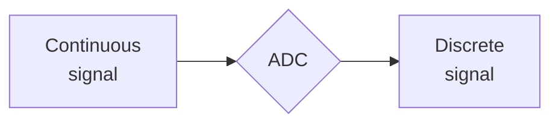
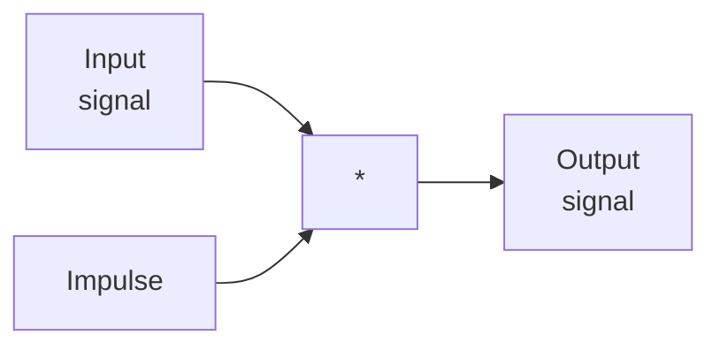

# General

**Signal** describes how one parameter relates to another. Signals in the real-world are continuous by nature. Passing a **continuous signal** through an **analog-to-digital converter (ADC)**  converts it to a digitized or **discrete signal**.

A signal is made up of two parameters, the **independent variable** and the **dependent variable**. The _vertical axis_  represents the **dependent variable** while the _horizontal axis_ represents the **independent variable**. The dependent variable is a function of the independent variable. The independent variable describes how and when a sample is taken, the dependent variable is the actual measurement.

**Sample** is a digitized signal point. The total number of samples is denoted by **N**.

**Mean of the signal** ($\mu$) is the average value of of a signal. In electronics, the man is known as the **DC value**. The **standard deviation** ($\sigma$) is a measure of how far the signal from the man. The power of this function is known as the **variance** ($\sigma^2$).

**Quantization** is the process of mapping continuous infinite values to a smaller set of discrete finite values:

The **Sample and Hold (S/H)** is a sub-module which converts independent variables (x-axis values) from continuous to discrete.
The **Quantizer** sub-module converts dependent variables (y-axis values) from continuous to discrete.

**Proper sampling** is defined as the ability to reconstruct an exact analog from samples.

# Nyquist Theorem

**Sampling theorem (Nyquist Theorem)** states that a continuous signal can properly be sampled only if it does not contain frequency components above half of the sampling rate (e.g. sample rate is $50Hz$, the analog signal we are sampling be made of frequencies from $25Hz$ and below):
$$ f_s >= 2f_{max} $$

* Before signal enters the ADC it is first pass through usually an analog low-pass filter.
* This filter (also known as the **anti-alias filter**) removes frequency components above $f_s/2$.
* The anti-alias filter prevents aliasing effect when components with higher frequency become indistinguishable from components with lower frequency.
* The filtered analog signal is passed through the ADC, a digitized signal is then processed
* Any digital processing on digitized signal can be made.
* Then the signal pass to **DAC** (Digital-Analog-Converter) which reconstructs final analog signal.
* Output of the **DAC** is passed through another analog filter (also known as the **reconstruction filter**) to remove frequency components above $f_s/2$.
* Usually analog signal reconstruction elements are not present and processing ends up by digital processing step

# Analog Filters

### Passive Low-Pass Filter

The cut-off frequency calculation formula:
$$ f_c=\frac 1 {2 \pi RC} $$

* This filter passes low frequencies and blocks high frequencies.
* Constructed using resistors and capacitors (also known as RC passive low-pass filter).
* The range of frequencies for which a filter _does not cause significant attenuation_ is called the **pass-band**.
* The range of frequencies for which the filter does cause significant attenuation is called the **stop-band**.
* The cutoff frequency $f_c$ specifies where the filter begins signal attenuation.
* Attenuation corresponds to reducing signal amplitude by $3dB$ (50% reduction in power).
* At high frequency capacitor becomes a short circuit.
* At low frequency capacitor is an open circuit.

# Passive High-Pass Filter

The cut-off frequency calculation formula:
$$ f_c=\frac 1 {2 \pi RC} $$

* This filter passes high frequency and blocks low frequencies
* Constructed using resistors and capacitors (also known as RC passive high-pass filter)
* At high frequency capacitor becomes a short circuit
* At low frequency capacitor is an open circuit

Practical vs ideal Filter

In practice there is a transition range between pass-band and stop-band ranges.

# Active Filter

* Passive filters are made up of passive components only (e,g, resistors, capacitors and inductors)
* Active filters are made up of both passive and active components (+ operational amplifiers and transistors)
* One advantage of active filters over passive filters is their ability to provide signal gain (i.e. amplify the signal)

### Active Low-Pass Filter

### Modified Sallen-Key Filter

This filter serves as a building block for designing active filters such as Chebyshev, Butterworth and Bessel.

Formulas:
 $R = \frac {k_1} {Cf_c}$ and  $R_f = R_1k_2$

Example of 3 stages and 6 pole filter:

The selected $k_1$ and $k_2$ values will determine whether a cascaded modified sallen-key filter forms a Chebyshev, Butterworth or Bessel filter (see table above):

### Most common configurations

Most often used analog filters:
* Chebyshev
* Butterworth
* Bessel

* Each of aforementioned filters is designed to optimize a different performance parameter.
* The complexity of each filter can be adjusted by selecting the number of poles and zeros
* Poles and zeros of a transfer function are the frequencies for which the value of the denominator and numerator becomes zero respectively
* The values of the poles and the zeros of a system determine whether the system is stable or not
* The more poles in a filter, the more electronics is requires and the better it performs

# Chebyshev Filter

The **step response** tells how the filter responds when the input rapidly changes from one value to another.

| Frequency Response                                              | Step Reponse                                                    |
| --------------------------------------------------------------- | --------------------------------------------------------------- |
|  |  |

 
* The more poles (see frequency response for 8 poles Chebyshev filter) the closer the filter to ideal (transition is quite small)
* Provides the **sharpest roll-off** (amplitude drop)
* Characterized by ripples in the pass-band
* Step response characterized by overshoots and oscillations that slowly decrease in amplitude

### Butterworth Filter

| Frequency Response                                              | Step Reponse                                                    |
| --------------------------------------------------------------- | --------------------------------------------------------------- |
|  |  |

* Provides the **flattest pass-band** among the three filters
* Optimized to provide the sharpest roll-off possible without allowing ripple in the pass-band
*  Step response characterized by overshoots and oscillations that slowly decrease in amplitude, but slightly less than in the Chebyshev

### Bessel filter

| Frequency Response                                              | Step Reponse                                                    |
| --------------------------------------------------------------- | --------------------------------------------------------------- |
|  |  |

* This filter has no ripple in the pass-band but the roll-off far worse than the Butterworth filter
* **No overshoots and oscillations (best step response)**

### Linear System

**System** is a process that produces an output signal in response to an input signal.  A signal describes how one parameter relates to another.

Notation:
* Continuous signals use parentheses: $x(t)$, $y(t)$
* Discrete signals use brackets: $x[t]$, $y[t]$

Information encoding in an analog waveform:
* **Time domain encoding**: information is encoded in the sine waves of the signal
* **Frequency domain encoding**: information is encoded in the shape of the waveform

#### Properties:

**Homogeneity** - a change in the amplitude of the input signal results in a corresponding change in the amplitude of the output signal:
$kx[n] \rightarrow \boxed {system} \rightarrow ky[n]$

**Additivity** - a system is said to be additive if added signals pass through it without interacting
$x_1[n] \rightarrow \boxed {system} \rightarrow y_1[n]$
$x_2[n] \rightarrow \boxed {system} \rightarrow y_2[n]$
$x_1[n] + x_2[n] \rightarrow \boxed {system} \rightarrow y_1[n] + y_2[n]$

**Shift Invariance** - A shift in the input signal causes an identical shift in the output signal
$x[n] \rightarrow \boxed {system} \rightarrow y[n]$
$x[n+s] \rightarrow \boxed {system} \rightarrow y[n+s]$

### Superposition

* The response of a linear system to a sum of signals is the sum of the responses to each individual input signal (according to _Additivity_ property)
* Synthesis involves adding two or more signals to form a resulting signal
* Decomposition is the opposite of synthesis
* Decomposition involves breaking one signal into two or more additive component signals
* Output signal obtained is identical to the one produced by directly passing input signal through the system without decomposition and synthesis

#### Impulse Decomposition

* Impulse decomposition breaks the N samples signal into N component signals, each containing N samples
* Each of the component signals contains one point from the original signal, with the remainder of the values being zero
* A single nonzero point in a string of zeros is called an impulse
* Impulse decomposition allows signals to be examined one sample at a time
* By knowing how a system responds to an impulse, the system's output can be calculated for any given input

#### Step decomposition

* Step decomposition also breaks the N samples signal into N component signals, each containing N samples
* Each **component signal is a step**, meaning the first samples have a value of zero, while the last samples are some constant value.
* Step decomposition characterized signals by the difference between adjacent samples

# Convolution

Properties:
* Commutative: 
$$a[n] * b[n] = b[n] * a[n]$$
* Associative:
$$(a[n]*b[n]) * c[n] = a[n]*(b[n]*c[n]$$
* Distributive:
$$a[n]*b[n]+a[n]*c[n] = a[n]*(b[n]+c[n])$$

* Linear Time-Invariant (LTI) system (e.g. digital filter) is a system that take input signal $x[n]$ and produce output signal $h[n]$ also known as impulse response.
* Convolution is mathematical operation of combining two signals together to get a resultant signal:

* **Delta function** (also called Kronecker delta function) is a normalized impulse response, **sample number zero has a value of one**, while all other samples have a value zero:
	* The delta function is a probe used to *inspect* a system
	* The delta function is also called the unit impulse
	* The delta function acts as the basic atomic component of DSP
	* It is denoted by
	$$\delta[n] = \begin{cases} 1, n=0 \\ 0, n\not=0 \end{cases}$$
* **Impulse response** is the signal produced as an output of the system when delta function is provided to the input of the system:
	* Two different systems will produce two different impulse
	* It is denoted as $h[n]$

* Any impulse can be represented as a shifted and scaled delta function (e.g. all zeros except sample number 8, which has a value of -3)

* In digital filter design the impulse response is called the **filter kernel**, the **convolution kernel** or **the kernel**.
* In image processing the impulse response is called the **point spread function**.
* **Knowing how the system responds to one impulse ($h[n]$) gives the fingerprint of the system needed to construct it's response ($y[n]$) to any input ($x[n]$)**

Any arbitrary input signal $x[n]$ can be viewed as a series of scaled and time-shifted delta functions:
$$x[n] = \sum_{k=-\infty}^\infty {x[k] \delta{[n-k]}}$$

Output of the system:
$$ y[n] = \underbrace{\sum_{k=-\infty}^\infty {x[k]\cdot h[n-k]}}_{h \space over \space x} = \underbrace{\sum_{k=-\infty}^\infty {h[k]\cdot x[n-k]}}_{x \space over \space h} $$

Where $n$ is the output time index; $k$ is a summation index, k steps through every non-zero sample of $x[k]$ to accumulate a weighted sum ($h \space over \space x$ variant).
Sliding $x \space over \space h$ is more preferred in DSP as $h$ consists of fixed, known coefficients (often called filter taps), whereas $x$ is the streaming input signal.

For example: $x[n] = [2,-1,3]$
* At sample n=0, value is 2
* At sample n=1, value is -1
* At sample n=2, value is 3
* The input signal can represented as follows:

$$ x[n] = \underbrace{2\cdot\delta[n]}_{n=0} + \underbrace{(-1)\cdot\delta[n-1]}_{n=1} + \underbrace{3\cdot\delta[n-2]}_{n=2} $$

The output according to the following rules:
* Rule A - Time-Invariance: if a single spike at time $n=0 (\delta[n])$ produces the impulse $h[n]$. Shifting to time n=1 will produce the exact same shape, just shifted to time $n=1 (h[n-1])$ 
* Rule B - Linearity: if a unit spike $\delta[n]$ gives $h[n]$ then scaled by 2 ($2\delta[n]$) gives $2h[n]$
* Rule C - Superposition: if you pass a combination of spikes into the system, the total output is simply the sum of the individual outputs.

Since, we know the input signal $x[n]=[2, -1, 3]$ the output signal can be computed by summing the individual responses:
* The sample $x[0] = 2$ triggers an output response of $2 \cdot h[n]$
* The sample $x[1] = -1$ triggers an output response of $-1 \cdot h[n-1]$
* The sample $x[2] = 3$ triggers an output response of $3 \cdot h[n-2]$

$$y[n] = 2 \cdot h[n] - 1 \cdot h[n-1] + 3 \cdot h[n-2]$$

### Convolution Operation

* Input signal is decomposed into components
* Each component is passed through the system
* Each of the nine samples in the input signal will contribute a scaled and shifted version of the impulse response to the output signal (see picture below)
* Output components produced by the system are then synthesized to produce the output signal
* A 9 point of the input signal ($x[n]$) is passed through a system with a 4 point impulse response ($h[n]$) resulting in a 9+4-1 = **12 points** of output signal ($y[n]$). We have additional 3 components when the last input signal component is passed through a system with 4 point impulse:

Calculation for the sample number 4:
* Sample index: $4$
* Value: $1.4$
* After decomposition: $1.4 \cdot \delta[n-4]$ (delta function scaled and shifted to the right)
* After system: $1.4 \cdot h[n-4]$ (impulse response shifted and scaled to the right)
* Zeros are added at samples $0-3$ and at the samples $8-11$ to serve as place holders

$$ y[4] = x[1] \cdot h[n-1] + x[2] \cdot h[n-2] + x[3] \cdot h[n-3] + x[4] \cdot h[n-4] $$
$$ y[4] = x[1] \cdot h[4-1] + x[2] \cdot h[4-2] + x[3] \cdot h[4-3] + x[4] \cdot h[4-4] $$
$$ y[4] = x[1] \cdot h[3] + x[2] \cdot h[2] + x[3] \cdot h[1] + x[4] \cdot h[0] $$

Note: All other summat are zero because scaling factor is zero ($x[0], x[5], x[6], x[7], x[8]$).

In general case (sliding $x \space over \space h$):

$$ y[i] = \sum_{j=0}^{M-1} h[j] \cdot x[i-j] $$

Note: $i$ is the sample number, $M$ is a number of impulse response components.

This equation *allows each point in the output signal* to be calculated independently of all other points in the output signal.
The index *i* determines which sample in the output signal is being calculated.
The index *j* is an iterator running through the impulse response.

### Delta function (closer look)

* The characteristics of a lines system is completely specified by the system's impulse response:
	* Digital filters are created by designing an appropriate impulse response
	* Radars detect enemy aircraft by analyzing a measured impulse response
* The simplest impulse response is the **delta function**
* When a system's impulse response is a delta function ($h[n] = \delta [n]$), the system acts as a perfect pass-through (an ideal wire of *Identity System*).
* Convolving any signal with a delta function results in exactly the same signal: $y[n] = x[n]$
* The delta function is the **identity of convolution**, just like 0 is the identity of addition and 1 is the identity of multiplication.

**Increasing** the amplitude of the delta function creates an impulse response that *amplifies* ($k>1$).

**Decreasing** the amplitude of the delta function creates an impulse response that *attenuates* ($k<1$).

$$ x[n] * k\delta[n] = kx[n] $$

**Sifting** the delta function to the right produces a corresponding **delay** between the input signal and the output signal ($s>0$).

$$h[n] = \delta[n-s]$$

$$y[n] = \sum_{k=-\infty}^\infty {x[k]\cdot h[n-k]} = \sum_{k=-\infty}^\infty {x[k] \delta [(n-k)-s]} $$

the term $\delta[n-k-s]$ is zero everywhere except $n-k-s=0$, which means $k=n-s$. Therefore, $y[n] = x[n-d]$. If $s=3$ then $y[10]=x[7]$. To calculate the output right now for sample 10, the system looks at what the input was 3 steps in the pas.

**Shifting** the delta function to the left produces a corresponding **advance** between the input signal and the output signal $s<0$.

$$x[n]*\delta[n+s] = x[n+s] $$

Such manipulation of impulse response is relevant for a complex impulse response because it's literally built out of individual scaled and shifted delta functions added together. For example:
$$h[n]=\frac 1 3 \delta[n] + \frac 1 3 \delta[n-1] + \frac 1 3 \delta [n-2] $$
### First Difference and Running sum

First difference:
$$y[n] = x[n] - x[n-1]$$

Running Sum:
$$y[n] = x[n]+y[n-1]$$

# Fourier Transform

## Introduction

* Fourier transform is a set of mathematical techniques based on decomposing signals into sinusoids.
* The version of Fourier transform used for discrete signals is known as Discrete Fourier Transform (DFT).

* Decomposition the 16 point long signal into 9 consine waves and 9 sine waves is the main purpose of DFT.

## Categories of signals and Fourier Transforms

* A signal can either **continuous** or **discrete** and it can be either **periodic** or **aperiodic**.
* This forms 4 categories of signals: aperiodic-continuous, periodic-continuous, aperiodic-discrete, periodic-discrete.
* Each of the four Fourier Transforms can be subdivided into teal and complex versions.
* The real version uses ordinary numbers while the complex version uses complex numbers.

| Type                 | Signal                                                          |                                                                                     |                                        |
| -------------------- | --------------------------------------------------------------- | ----------------------------------------------------------------------------------- | -------------------------------------- |
| Aperiodic-continuous |  | Extend to both positive and negative infinity without repeating a periodic pattern. | Fourier Transform                      |
| Periodic-Continuous  |  | Repeats themselves in a regular pattern from negative to positive infinity.         | Fourier Series                         |
| Aperiodic-Discrete   |  | Defined at discrete points between positive and negative infinity.                  | Discrete Time Fourier Transform (DTFT) |
| Perdiodic-Discrete   |  | Discrete and repeat themselves in a periodic pattern.                               | Discrete Fourier Transform (DFT)       |

## DFT Engine

$$ReX[k] = \sum_{i=0}^{N-1} x[i] \cos{\frac {2\pi ki} N} $$
$$ ImX[k] = -\sum_{i=0}^{N-1}x[i] \sin{\frac {2\pi ki} N} $$

* When an $N$ points time domain signal $x[]$ running from $0$ to $N-1$ is passed through **DFT**, two frequency domain signals are produced.
* Each of these signals are $N/2+1$ points long (length), running from $0$ to $N/2$
* The real signal written $ReX[]$ and the imaginary signal written $ImX[]$ (we are still dealing with ordinary numbers here *not complex numbers*, $ReX[]$ refer to cosine waves and $ImX$ refer to sine waves).
* Working with $ReX[]$ and $ImX[]$ we dealing with cosine and sine waves **amplitudes**.

## Time domain vs. Frequency domain

* Time domain refers to samples taken over time
* Frequency domain describes the amplitudes of the sine and cosine waves produced.
* The frequency domain contains exactly the same information as the time domain just in a different format.
* Knowing one domain allows us to calculate for the other.
* Time domain signals are represented by lower case letters (e.g. $x[]$, $y[]$).
* Frequency domain signals are represented by upper case letters (e.g. $X[]$, $Y[]$)

## Forward DFT vs Inverse DFT (IDFT)

The horizontal axis of the frequency domain can be labelled in 3 ways:
1. As an array index running from $0$ to $N/2$
2. As a fraction of the **sampling frequency** running from $0$ to $0.5$ (according to Nyquist theorem our signal does not contain frequencies above the half of sampling frequency)
3. As a natural frequency running from $0$ to $\pi$

# Duality

Frequency and time domains are completely symmetrical. The symmetry between the time and frequency domains is called duality:

| Frequency      | Time Domain    |
| -------------- | -------------- |
| Single Point   | Sinusoid       |
| Sinusoid       | Single Point   |
| Convolution    | Multiplication |
| Multiplication | Convolution    |
# Polar Notation

Notations:
* Rectangular Notation: $ReX[k], ImX[k]$
* Polar Notation: $MagX[k],PhaseX[k]$

## R-to-P
$$MagX[k] = \sqrt{(ReX[k]^2+ ImX[k]^2)}$$
$$PhaseX[k]=\arctan(\frac {ImX[k]} {ReX[k]})$$
## P-to-R

$$ReX[k] = MagX[k]\cos(PhaseX[k]) $$
$$ImX[k]=MagX[k]\sin(PhaseX[k])$$

The same signal in rectangular and polar notation:

# Complex Fourier Transform

## Complex Numbers

Operations:
 * Addition: $(a+bj) + (c+dj) = (a+c)+j(b+d)$
 * Subtraction: $(a+bj)-(c+dj) = (a-c)+j(b-d)$
 * Multiplication: $(a+jb)(c+jd) = (ac - db) + j(bc+ad)$

Polar Notation:
* Magnitude: $M=\sqrt{(ReA)^2 + (ImA)^2}$
* Angle: $\theta = arctan[\frac {ImA} {ReA}]$

Rectangular Notation:
* $ReA = Mcos(\theta)$
* $ImA = Msin(\theta)$
* $a+jb = M(\cos \theta + j \sin \theta)$

Euler's Relation: 
* $e^{jx} = \cos x + j \sin x$
* $a+jb = Me^{j\theta}$
* $M_1e^{j\theta_1} M_2e^{j\theta_2} = M_1M_2e^{j(\theta_1 + \theta_2)}$
* $\frac {M_1e^{j\theta_1}} {M_2e^{j\theta_2}} = \frac {M_1} {M_2} e^{j(\theta_1 - \theta_2)}$

Representation of sinusoid:
* $Acos(\omega x) + Bsin(\omega x) \equiv a+ jb$ where $\omega = 2\pi f$
	* $A \equiv a$ (amplitude of cosine wave)
	* $B \equiv - b$ (negative amplitude of sine wave)
* $Mcos(\omega t + \phi) \equiv Me^{j\theta}$
	* $M \equiv M$ (amplitude of cosine wave)
	* $\theta \equiv -\phi$

Example:

## Mathematical Equivalence

$$e^{jx} = \cos(x) + j\sin{x}$$
$$\cos(x) = \frac {e^{jx} + e^{-jx}} 2$$
$$\sin(x) = \frac {e^{jx} - e^{-jx}} 2$$
$$ cos(\omega t) = \frac 1 2 e^{-(\omega) t} + \frac 1 2 e^{j\omega t} $$
$$ sin(\omega t) = \frac 1 2 e^{-(\omega) t} - \frac 1 2 e^{j\omega t} $$

## Complex DFT

* Using polar notation:
$$X[k] = \frac 1 N \sum_{n=0}^{N-1} x[n]e^{-j2k\pi n/N} $$

* Using rectangular notation:

$$X[k] = \frac 1 N \sum_{n=0}^{N-1}x[n](\cos(\frac {2\pi kn} N) - j\sin(\frac {2\pi kn} N))$$
## Inverse Complex DFT

$$X[k] = \frac 1 N \sum_{n=0}^{N-1}x[n]e^{j \frac {2\pi} N kn}$$
where $k=0,1,..,N-1$
# Fast Fourier Transform

|                                                                 |
| --------------------------------------------------------------- |
|  |
|  |
|  |
|  |
|  |
|  |
|  |
|  |
|  |
|  |
|  |

# Digital Filters

Purposes:
* Signal Separation
* Signal Restoration

Every linear filter corresponds to particular:
* Impulse Response
* Frequency Response
* Step Response
Knowing impulse response we can calculate the other two.

Impulse response is the output of the input when the input is an impulse. In the same way the step response is the output when the input is a step known as an edge and represents the integral of the impulse response.
Two ways to find step response:
1) feed a step waveform into a filter and see what comes out;
2) integrate the impulse response.
The frequency response can be found by taking the DFT of the impulse response. 

## Decibel

bell: Power change by factor of 10 (e.g. 4 bell = $10*10*10*10$)
decibel (dB) = $1/10$ of a bell (-20 dB = 0.01, -10 dB = 0.1, 0 dB = 1, 10 dB = 10, 20 dB = 100)

The amplitude is proportional to the square root of power (e.g. amplifier with 20 dB of gain by definition means increasing by a factor of 100 for a power and by a factor of 10 for an amplitude).

Formulas for calculating gain factor:
 $dB=10\log_10 \frac {P_2} {P_1}$
$dB = 20\log_10 \frac {A_2} {A_1}$

## Information representation

Time domain domain describes when something occurs an what the amplitude of the occurrences.
Information represented in the frequency domain is more indirect and obtained by measuring the frequency, the phase and the amplitude of periodic motion.

The step response describes how information represented in the time domain is being modified by the system. Frequency response shows how information represented in the frequency domain is being changed.

Time and frequency distinction is absolutely important in filter design because it is not possible to optimize a filter for both applications. Good performance in the time domain result in poor performance in the frequency domain and vice-versa. For example, designing a filter to remove noise from an ECG  (time domain) require pay attention to step response and the frequency response is of little concern.

## Time domain parameters

* Step response (Fast Step Response + No overshoot are characteristics of good filter)

* Overshoot

Overshoot must be eliminated because it changes the amplitude of the samples in the signal.

* Phase Linearity

The image on the left represents symmetric of the amplitude over time between up and bottom parts. This symmetric is needed to make the rising edges look the same a the folding edges.

## Frequency domain parameters

* Pass-band: frequencies allowed to pass
* Transition-ban: frequencies between pass-band and stop-band
* Stop-band: frequencies blocked
* Fast roll-off: narrow transmission band

## Designing using spectral inversion method

High-Pass filter through low-pass filter:

Restrictions:
* The original filter must have a left-right symmetry (linear phase)
* Impulse must be added at the center of symmetry

## Designing using spectral reversal method

## Classification

Time domain filters are used when the information is encoded in the shape of the signals waveform. Such filtering is used for smooth, 9dc removal, waveform shaping.
Frequency domain filters are used when the information is contained in the amplitude, frequency and phase of the component sinusoids. The goal of these filters is to separate one band of frequencies from another.

Basic responses: 
* High-pass
* Low-Pass
* Band-pass
* Band-reject

Custom filters are used for something more special outside of basic responses.

# Finite Impulse Response (FIR) Filters

## Moving Average Filters

The most common filter in DSP mainly because it is the easiest digital filter to understand and in use among common task which is reducing random noise while retaining sharp step response. **This is the best filter in time encoded signals.**

$$y[i] = \frac 1 M \sum_{i=0}^{M-1}x[i+j]$$
where $x[i]$  - input signal, $y[i]$ - output signal, $M$ - number of points used in the moving average (e.g. 5 points).

For example: 

$$y[50] = \frac {x[50]+x[51]+x[52]+x[53]+x[54]} 5$$
where $y[50]$ - point 50 in a 5 point moving average.

The sample example but points are chosen symmetrically:

$$y[50] = \frac {x[48]+x[49]+x[50]+x[51]+x[52]} 5$$

**Amount of noise reduction is equal to the square-root of the number point averaged (e.g. 100-point moving average means noise reduction by factor of 10).**

Frequency response of the Moving-Average:
$$H[f] = \frac {\sin(\pi f M)} {M\sin(\pi f)}$$
where $M$- number of points, $f$ - runs between 0 and 0.5, when $f$=0 $H[f] = 1$

## Multiple Pass Moving Average Filter

## The Recursive Moving Average Filter

In this type of filter "recursion" do not have any in common with IIR filters and means only increasing calculation using previous output value.

Passing $x[i]$ through a 7-point moving average to obtain $y[j]$:

$$y[50] = x[47]+x[48]+x[49]+x[50]+x[51]+x[52]+x[53]$$
$$y[50] = x[48]+x[49]+x[50]+x[51]+x[52]+x[53]+x[54]$$
$$y[51]=y[50]+x[54]-x[47]$$
The pattern is expressed by:

$$y[i] = y[i-1]+x[i+p]-x[i-q]$$
where $p=\frac {M-1} 2$, $q=p+1$ and $M$ is a number of points in moving average.

# Infinite Impulse Response (IIR) Filters

Impulse response are composed of decaying exponential this distinguishes them from the digital filters carried out by convolution.

* Also known as recursive filters
* Long impulse response short convolution
* Rapid execution, less performance, less flexible

The Recursion Equation:
$$y[n] = a_0x[n]+a_1x[n-1]+a_2x[n-2]+a_3x[n-3]+...$$
$$+b_1y[n-1]+b_2y[n-2]+b_3y[n-3]+...$$

## The Single-Pole Recursion Filter

Single pole low-pass filter:

$$a_0=1-x; b_1=x$$
where $x$ is the amount of decay between adjacent samples (value between 0 and 1)

Single pole high-pass filter:

$$a_0=(1+x)/2; a_1=-(1+x)/2; b_1=x$$

## Digital Chebyshev Filters

* For frequency bands separation
* Less performance compared to windowed-sinc
* Faster that windowed-sinc

To design this filter we must decide four parameters:
* High-pass or low-pass response
* Cut-off frequency
* Percentage of pass-band ripples
* Number of poles

## The Windowed-Sync Filters

* Frequency band separation
* Bad time domain performance

## The sinc function and the truncated sinc filter

Sinc Function: $\frac {\sin(x)} x$

Filter kernel: $h[i]=\frac {\sin(2\pi f_ci)} {i \pi}$

## The Blackman or Hamming Window

The impulse response coefficients $h[i]$ are given by:

$$h[i] = h_{ideal}[i] \cdotp \omega_{Hamming/Blackman} [i]$$

### Hamming Window

$$h[i] = K(\frac {\sin(2\pi f_c(i - M/2))} {i-M/2}) [0.42 - 0.5\cos(\frac {2\pi i} M)]$$

Piece-wise form with handling the indeterminate case:
$$
h[n] = \begin{cases}
   2f_c, \space for \space \frac M 2 \\
   {\frac {\sin(2\pi f_c (n - \frac M 2)} {\pi (n - \frac M 2)} \cdot [0.54-0.46\cos(\frac {2\pi n} M)]} \space for \space n\ne\frac M 2 
\end{cases}
$$

where $f_c=\frac {f_{cutoff}} {f_{sample}}$ is a normalized cut-off frequency bounded by $0 < f_c < 0.5$
### Blackman Window

$$h[i] = K(\frac {\sin(2\pi f_c(i - M/2))} {i-M/2}) [0.54 - 0.46\cos(\frac {2\pi i} M) + 0.08\cos(\frac {4\pi i} M)]$$

Piece-wise form with handling the indeterminate case:

$$
h[n] = \begin{cases}
   2f_c, \space for \space \frac M 2 \\
   {\frac {\sin(2\pi f_c (n - \frac M 2)} {\pi (n - \frac M 2)} \cdot [0.42 - 0.5\cos({\frac {2\pi n} M}) + 0.08\cos(\frac {4\pi n} M)]} \space for \space n\ne\frac M 2 
\end{cases}
$$

where $f_c=\frac {f_{cutoff}} {f_{sample}}$ is a normalized cut-off frequency bounded by $0 < f_c < 0.5$
